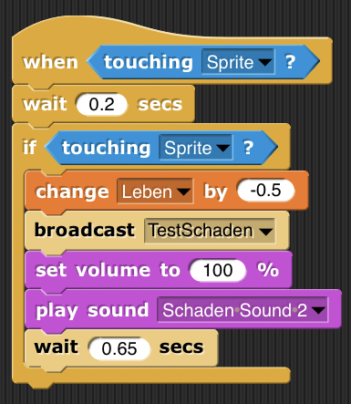
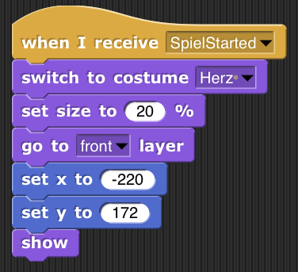
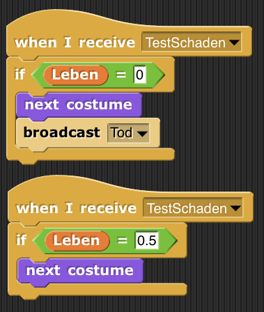
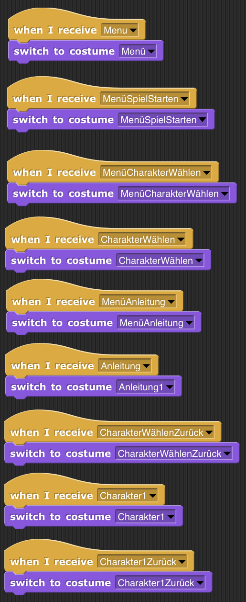
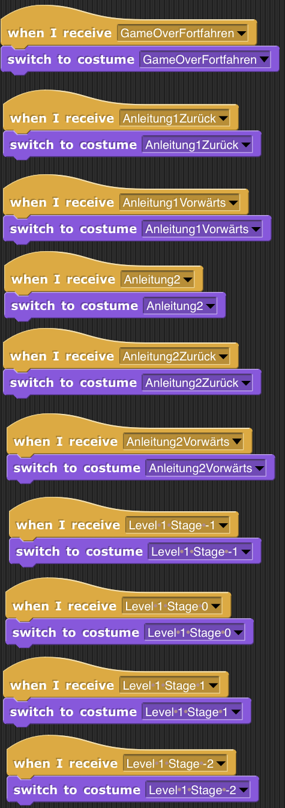
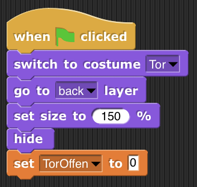
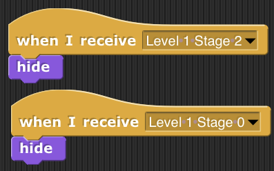
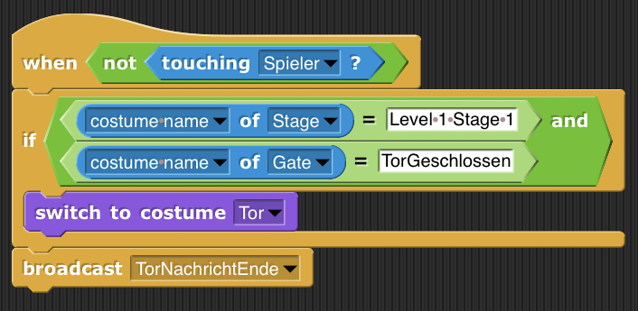

# 2D Puzzle Game
## Links

1. [Projektseite](https://github.com/ThorgeHamprecht/Informatik-Projekt-Nr.-1/blob/main/2D%20Puzzle%20Game.md)
2. [Spiel - Snap! Cummunity Site](https://snap.berkeley.edu/project?user=faiture&project=2D%20Puzzle%20Game)

## Spielkonzept
Bei x handelt es sich um ein 2D Adventure Spiel mit Puzzle und Platform Elementen. Der Spieler hat dabei die Aufgabe das Ende des Levels durch das Lösen von "Rätslen" und bewältigen von Platform-Passagen zu erreichen.

*Das Setup*
Bevor das Spiel startet, hat der Spieler die Möglichekit sich in dem Startmenü im Zuge der Anleitung über das Spielprinzip, das Spielziel und das Steuern der Spielfigur zu informieren.
Anschließend hat der Spieler die Möglichkeit sich über den Button "Charakter Wählen" eine beliebige Spielfigur auszusuchen.
Dabei gibt es drei Figuren zur Wahl.

*Spielstart*
Fühlt sich der Spieler bereit, so kann er über die Betätigung des Buttons "Spiel Starten" das Spiel beginnen.
Folglich befindet sich die Spielfigur in der Stage 0 sowie im ersten Level.
Die Spielfigur kann auf der braunen Unterfläche nach rechts und links laufen. Zudem besteht die Möglichkeit mit Betätigung der Taste "S" oder dem Leerzeichen zu springen.
Oben links in der Ecke sind die drei Leben der Spielfigur angezeigt. Diese werden, z.B. bei Berührung der Lava oder der Laserstrahlen weniger, bis die Spielfigur schließlich stirbt und das Spiel vorbei ist.

*Spielkonzept/Spielziel*
Der Spieler wird nun die Spielfigur in die verschiedenen Richtungen steuern. 
Das Ziel des Spiels ist es, das Level zu schaffen.
Dafür muss der Spieler es schaffen Punkt X zu erreichen. Wie der Spieler seine Spielfigur dort hinsteuert, muss er selbst herrausfinden.
Auf dem Weg zum Schaffen des Levels erwarten den Spieler viele Herrausfoderungen. 
Beispielsweise muss an einer Stelle ein Schlüssel gefunden werden, um ein Tor zu öffnen. Zudem muss der Spieler es schaffen, dass seine Spielfigur nicht in die Lava tritt und nicht von den Laserstrahlen getroffen wird.

Mit diesem Spielkonzept ist unsere Absicht ein spannendes, kreatives und Reizvolles 2D Spiel zu entwerfen, welches für den Spieler sowohl fordern als machbar ist.

## Die Erklärung des Codes

**Die Grundeigenschaften des Spielers**

*Sprite Spieler*

**Sprite Spieler**

Mit diesem Code haben wir die Grundlage für die Lebensweggnahme schaffen. Dieser Code befindet sich unter dem Objekt Spieler. Dieser Befehl wird nur ausgeführt wenn der Spieler sich auf dem "Sprite", in unserem Fall der Lava befindet. Damit wollen wir erreichen, dass dem Spieler ein Schaden zugefügt wird. Zunächst haben wir die Bedingung, dass dieser Code ausgeführt wird auf 0,2 Sekunden eingestellt. Dadurch wird der Schaden bei erstmaligem Betreten der Lava direkt ausgeführt.  Dann verliert der Spieler 0,5 Leben. Die Leben werden im Folgenden noch genauer beschrieben. Die Steuerung der Herzen erfolgt dann durch die Anweisung "broadcast TestSchaden". Dieser Schaden wird außerdem durch einen von uns erstelltem Sound unterstützt. Mit der Anweisung "set volume to 100%" und "play sound schaden" haben wir diese Anweisung in Code umgesetzt. Zum Schluss steht die Anweisung 0,65 Sekunden zu warten. Damit wollen wir bewirken, dass nicht dauerhaft ein Leben abgezogen wird, sondern nur wenn der Spieler sich auf dem "Sprite" Lava befindet. Somit kann der Spielende die Figur beim erreichen der Lav auch wieder herausbewegen, um weiteren Schaden zu verhindern. Wenn sich der Spieler jedoch auch nach 0,65 Sekunden immer noch auf der Lava befindet wird dieser Code erneut ausgeführt.

**Sprite Leben 3**

Dieser Code ist unter dem Sprite des dritten Herzens vorzufinden. Dieser Code codiert für die generellen Informationen des Herzens. Immer wenn das Spiel gestartet wird erscheint das Herz. Dies ist durch die Befehle "when I receive SpielStartet" und "switch costum to Herz" ausgedrückt. Durch den Befehl "set size to 20%" wird die Orginalgröße des Herzens auf dem ursprünglich eingefügten png-Bild auf 20% der Originalgröße herabgesetzt, damit alle drei Herzen nebeneinander passen.
Das Herz soll zudem im Vordergrund erscheinen. Um dies zu erreichen haben wir den Code "go to front layer" eingefügt. 
Ein weitere wichtiger Teil diese Code-Blockes ist die eingestellte Position des Herzens. Durch die X-Koordinate -140 und die Y-Koordinate 172 haben wir die Position am oberen linken Rand des Spieles eingestellt. Das dritte Herz ist dabei das Herz, welches sich von den drei Herzen am weitesten rechts befindet, weil dieses Herz bei einem Schaden zuert reagieren und erlischen soll, damit die Leben von rechts nach links weniger werden. Der letzte Befehl in diesem Codeblock ist der Befehl "show". Damit wollen wir erreichen, dass das Herz erst bei Spielstart angezeigt wird.

Durch diesen Code haben wir den Costume-Wechsel programmiert. Wenn der Befehl "TestSchaden" ausgeführt wird, wird dieser Code ausgeführt. Dieses Ausführen des Codes ist allerdings an die Bedingung gekoppelt, dass sich die Lebenanzahl über 1,5 befindet. Diese Zahl startet bei Spielstart bei drei Leben. Das Event "TestSchaden" wird im Spieler-script erst nachdem bereits 0,5 von den ursprünglichen 3 abgezogen worden sind ausgeführt. Somit wird dieser Code in dem Script "Leben 3" genau 2 mal ausgeführt: Einmal bei 2,5 und das nächste mal bei 2. Sind diese Bedingungen erfüllt, so wird das Costume gewechselt.
Die drei erstellten Costumes gelten für alle drei Herzen und sehen wie folgt aus:

1. Hier ist das Herz noch "ganz". Der Code wurde bisher nicht ausgeführt.

2. Hier ist ein halbes Herz zu sehen. Der Coder wurde bisher einmal, bei der Lebenanzahl von 2,5 ausgeführt.

3. Hier ist nur noch der Umriss des Herzens zu sehen. Der Code wurde zweimal ausgeführt und die Lebenanzahl ist nun nicht mehr größer als 1,5. Der Spielende hat somit ein ganzes Leben verloren.

Um den Code untger dem Element vollständig zu erklären fehlt nun noch die Erklärung des folgender restlicher Codes, welcher für das Verstecken des Herzens verantwortlich ist:
1. Wenn das Programm gestartet wird soll das Herz nicht zu sehen sein. Darum haben wir "When I receive flag hide" eingefügt.
2. Wenn Der Spielende auf das Menü klickt, nach Spielstart soll das Leben noch nicht sichtbar sein. Darum haben wir den Code "When I receive Menu hide" eingefügt.
3. Außerdem soll das Herz verschwinden, wenn der Spielende das Level verloren hat und wieder zum Startmenü zurückgeleitet wird. Der Code dafür ist der dritte Code im folgenden Bild. 
Das Gegenstück zu diesen "hide" Befehlen stellt das "show" dar, welches bereits im ersten Code von diesem Sprite erkäutert wurde.

**Sprite Leben 2**

Der Code unter dem Sprite "Leben 2" ist ähnlich mit dem bereits erläuterten Code es Sprites "Leben 3". 
Immer wenn das Spiel gestartet wird erscheint das Herz. Dies ist durch die Befehle "when I receive SpielStartet" und "switch costum to Herz" ausgedrückt. Durch den Befehl "set size to 20%" wird die Orginalgröße des Herzens auf dem ursprünglich eingefügten png-Bild auf 20% der Originalgröße herabgesetzt, damit alle drei Herzen nebeneinander passen.
Das Herz soll zudem im Vordergrund erscheinen. Um dies zu erreichen haben wir den Code "go to front layer" eingefügt. 
Die Position des Herzens wird durch die X-Koordinate -180 und die Y-Koordinate 172 haben wir die Position am oberen linken Rand des Spieles eingestellt. Das zweite Herz befindet sich damit genau zwoschen dem dritten Herz und dem zweiten Herz. 
Der letzte Befehl in diesem Codeblock ist der Befehl "show". Damit wollen wir erreichen, dass das Herz erst bei Spielstart angezeigt wird.

Mit dem folgenden Code bewirken wir, dass das Costume immer zur richtigen Zeit gewechselt wird. Die Costumes des zweiten Herzens sind die gleichen wie bei dem dritten Herz, weshalb sie unter diesem Sprite nicht erneut eingefügen werden.
Durch diesen Code wird das Costume genau zwei mal geändert. Einmal wenn die Lebensanzahl genau 1,5 ist und das zweite mal wenn die Lebenanzahl genau 1 ist. Das Abziehen um jeweils 0,5 Leben ist bereits unter dem Sprite "Spieler" erläutert.

Um den Code untger dem Element vollständig zu erklären fehlt nun noch die Erklärung des folgender restlicher Codes, welcher für das Verstecken des Herzens verantwortlich ist:
1. Wenn das Programm gestartet wird soll das Herz nicht zu sehen sein. Darum haben wir "When I receive flag hide" eingefügt.
2. Wenn Der Spielende auf das Menü klickt, nach Spielstart soll das Leben noch nicht sichtbar sein. Darum haben wir den Code "When I receive Menu hide" eingefügt.
3. Außerdem soll das Herz verschwinden, wenn der Spielende das Level verloren hat und wieder zum Startmenü zurückgeleitet wird. Der Code dafür ist der dritte Code im folgenden Bild. 
Das Gegenstück zu diesen "hide" Befehlen stellt das "show" dar, welches bereits im ersten Code von diesem Sprite erkäutert wurde.

**Sprite 1**

Der Code unter dem Sprite "Leben 1" ist ähnlich mit den bereits erläuterten Codes Sprites "Leben 3" und "Leben 2". 
Immer wenn das Spiel gestartet wird erscheint das Herz. Dies ist durch die Befehle "when I receive SpielStartet" und "switch costum to Herz" ausgedrückt. Durch den Befehl "set size to 20%" wird die Orginalgröße des Herzens auf dem ursprünglich eingefügten png-Bild auf 20% der Originalgröße herabgesetzt, damit alle drei Herzen nebeneinander passen.
Das Herz soll zudem im Vordergrund erscheinen. Um dies zu erreichen haben wir den Code "go to front layer" eingefügt. 
Die Position des Herzens wird durch die X-Koordinate -220 und die Y-Koordinate 172 haben wir die Position am oberen linken Rand des Spieles eingestellt. Das zweite Herz befindet sich damit genau zwoschen dem dritten Herz und dem zweiten Herz. 
Der letzte Befehl in diesem Codeblock ist der Befehl "show". Damit wollen wir erreichen, dass das Herz erst bei Spielstart angezeigt wird.

Auch unter diesem Herz sind die anfängliche erklärten Costumes gleich. 
Mit diesen beiden Codes soll eingestellt werden, dass sich das Costume bei der entsprechenden Lebenanzahl 0,5 und bei 0 ändert. Bei 0,5 wird nur, wie auch zuvor, ein halbes Herz abgezogen. Bei der Lebensanzahl 0 ist noch eine besonderheit vorzufinden. Der Spielende hat alle Leben verloren und somit ist das Spiel beendet. 
Deshalb wird nach Abzug des letzten halben Lebens "broadcast Tod" ausgeführt. Die Damit einhergehenden weiteren Ausführungen sind unter dem Spielerscript erklärt

Auch in diesem HErz gelten die ursprünglichen Einstellungen, um das Herz nur im Spiel sichtbar zu machen. Diese lauten:
1. Wenn das Programm gestartet wird soll das Herz nicht zu sehen sein. Darum haben wir "When I receive flag hide" eingefügt.
2. Wenn Der Spielende auf das Menü klickt, nach Spielstart soll das Leben noch nicht sichtbar sein. Darum haben wir den Code "When I receive Menu hide" eingefügt.
3. Außerdem soll das Herz verschwinden, wenn der Spielende das Level verloren hat und wieder zum Startmenü zurückgeleitet wird. Der Code dafür ist der dritte Code im folgenden Bild. 
Das Gegenstück zu diesen "hide" Befehlen stellt das "show" dar, welches bereits im ersten Code von diesem Sprite erkäutert wurde.

**Sprite Stage**

Dieses Sprite ist dafür da, das Menü unseren Spieles zu programmieren. Mit diesem Sprite gehen viele weitere Einstellungen einher. Zunächst bewirkt der folgende Code, dass immer dann, wenn das Spiel gestartet wird und eine beliebige Taste auf der Tastatur gedrückt wird folgender Befehl ausgeführt wird.

Wenn das Spiel gestartet wird, dann wird das Costume zum "title screen" geändert. 
Der zweite Code codiert für den Costumewechsel, wenn das Menü verlassen wird. Wenn der Spielende auf den Button "Spiel Starten" clickt, dann wird er zu "Level 1, Stage 0" weitergeleitet.

Wenn der Name des Costume der Stage = "title screen" ist, wird

ausgeführt.

Die Folgenden Codes beschreiben immer den Wechsel der Costumes, wenn verschiedene "Buttons" von den Spielenden ausgewählt werden. 
Es werden damit im Folgenden sowohl die Wechsel der Costumes im Menü, als auch die Wechsel in den Leveln beschrieben bzw. codiert.

Die folgenden Codes codieren für die Charakterauswahl mit Pfeiltasten. Wir werden nun exemplarisch einen dieser Codes vorstellen, weil alle anderen auf dem gleichen Prinzip beruhen. 
Wenn der rechte Pfeil gedrückt wird und der Costumename des Charakters gleich dem Charakter 3 ist, dann wird der erste Charakter ausgewählt. Die Nummerireung ist unterschiedlich in der Stage und mit den Charakteren, sollte jedoch nicht verwirren.
Wir wollen damit unter dem Oberbegriff "Charakter Auswählen" die Chakterauswahl darstellen. Somit hat der Sielende die Auswahl, mit welchem Charakter er das Spiel spielen möchte. Es gibt dabei drei Charaktere zur Auswahl. Der grüne Charakterm, der rote und der schwarze.

Die in dem Menü aufgezeigten Hintergründe haben wir mit Power-Point designed. Anbei einen Link für die Powerpoint, die wir bei One-Drive hochgeladen haben.
Die einzelnen Spieler haben wir mit dem Programm Piskel designed. 
Bei dem erstellen der Power-Point Folien haben wir darauf geachtet, dass wir bei jedem Klick ein neues Bild brauchen.

LINK POWER POINT
<iframe src="https://onedrive.live.com/embed?cid=4B71CDACCDBBEF6A&amp;resid=4B71CDACCDBBEF6A%21133405&amp;authkey=AHU_iOwUgm8juWA&amp;em=2&amp;wdAr=1.3333333333333333&amp;wdEaa=1" width="1026px" height="793px" frameborder="0">Dies ist ein eingebettetes <a target="_blank" href="https://office.com">Microsoft Office</a>-Dokument, unterstützt von <a target="_blank" href="https://office.com/webapps">Office</a>.</iframe>
<iframe src="https://onedrive.live.com/embed?cid=4B71CDACCDBBEF6A&amp;resid=4B71CDACCDBBEF6A%21133405&amp;authkey=AHU_iOwUgm8juWA&amp;em=2&amp;wdAr=1.3333333333333333&amp;wdEaa=0" width="1026px" height="793px" frameborder="0">Dies ist ein eingebettetes <a target="_blank" href="https://office.com">Microsoft Office</a>-Dokument, unterstützt von <a target="_blank" href="https://office.com/webapps">Office</a>.</iframe>

**Stage Gate**

Mit dieser Stage wollen wir erreichen, dass beim Spielen in der ersten Stage ein Tor erscheint. 
Dies stellt ein Hinderniss da, womit wir den Spielenden zum nachdenken anregen wollen.
Um das Level zu beenden muss der Spieler durch das Tor durchgehen. Zu Beginn des Levels ist dieses Tor jedoch geschlossen und man braucht einen Schlüssel. Um diesen Schlüssel zu erreichen muss man in die Stage -1 und mit der Taste F den Schlüssel einsammeln und ihn anschließend vor dem Tor einlösen.

Mit dem Folgenden Code wird erreicht, das mit Spielstart das Costume zu "Tor" gewechselt wird. Der Spieler soll, wenn er an dem Tor vorbeiläuft, im Vordergrund zu sehen sein. Deshalb muss das Tor im Hintergrund erscheinen. Dies haben wir mit dem Code "go to back layer" eingestellt. 
Die Größe des Tores entspricht 150% der Originalgröße. Dies wird mit dem Code "set size to 150%" eingestellt.
Allerdings soll es, weil zu Beginn das Menü angezeigt wird, nicht bei dem ersten Drücken einer Taste erscheinen. Deshalb ist zunächst der Befehl "hide" eingefügt.
In diesem Code-Block ist der letzte Befehl, dass das Tor zu 0% geöffnet ist. Logischerweise soll es nämlich zu Beginn geschlossen sein, damit zunächst der Schlüssel zum Öffnen gesucht werden muss.

Durch die beiden folgenden Codes wird eingestellt, dass das Tor nicht auf allen Stages gezeigt wird. Es soll nur in einer bestimmten Stage eingestellt werden. Deshalb wird hiermit dafür gesorgt, dass es sowohl in Stage 0 und in Stage 2 nicht gezeigt wird.

![VsStudio]gateiffkeypressed.png

Bei den Costumes haben wir in der INternetseite Piskel die verschiedenen Stufen des Tores erstellt. Es soll so aussehen, als ob sich das Tor beim Drücken der Taste f fließend öffnet. Diese haben wir dann auch benannt und codiert, wie oben erklärt.

PDF für alle Menüelemente
<BODY>
  
</BODY>

 

  
  
  
 

